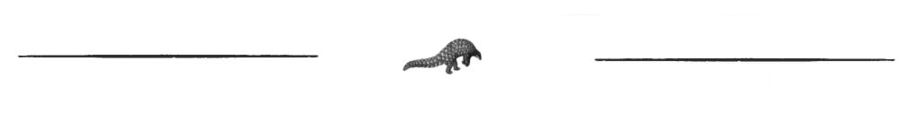

XXX
=========================================

The class ``XXX`` will only be used as a common parent for all other named entities classes.
As it is not safe to use, I describe it there just for fun.

Looking for *any*-XXX
^^^^^^^^^^^^^^^^^^^^^^^^^^^^^^^

Basic search
"""""""""""""

We want to find `YYY <https://en.wikipedia.org/wiki/>`_ (in French) on DBPedia::

    from pyneql.ontology.thing import XXX
    from pyneql.utils.endpoints import Endpoint
    from pyneql.utils.enum import LanguagesIso6391 as Lang

    # Creating the XXX using its label and the language of the label
    # If no language is specified, English is used.
    YYY = XXX(label=u'YYY', query_language=Lang.Amharic)

    # In order to query the new thing in the Semantic Web, we should
    # give (at least) one endpoint.
    YYY.add_query_endpoint(Endpoint.dbpedia)

    # Sending the query
    YYY.query()

Once the query is sent, the result information is stored in the object's
``attributes`` dictionary

Extended search
"""""""""""""""""

If the element we are looking for is ubiquitous in the Semantic Web, we may
want to search further. The function ``find_more_about()`` is doing that.
Before the exectution of the function ``find_more_about()``, we have 72 RDF predicates having values for Addis Abeba:

>>> YYY = XXX(label=u'አዲስ አበባ', query_language=Lang.Amharic)
>>> YYY.add_query_endpoints([Endpoint.dbpedia, Endpoint.wikidata])
>>> YYY.query(strict_mode=True, check_type=True)
>>> len(YYY.attributes)
72

Executing the function add some more

>>> YYY.find_more_about()
>>> len(YYY.attributes)
176

This feature just takes the URIs of the first result set which are the objects
of identity predicates (``skos:exactMatch``, ``owl:sameAs``) and retreive the associated RDF triples.

Accessing information
^^^^^^^^^^^^^^^^^^^^^^^^^^^^^^^

Raw information
""""""""""""""""

It is possible to access raw information like that::

    YYY.attributes

This dictionary contains all the information retrieved, so it is quite noisy.
For instance here for Addis Abeba, the content is::

    {
    }

Via keyword search
""""""""""""""""""""""

It is possible to search a keyword in the result set keys::

    YYY.get_attributes_with_keyword('abel')

This gives us a subset of results whose keys match the substring ``abel``::

    {
    }

.. note::
    It is not yet possible to filter results by languages. It's on my todo list. Feel free to contribute to the project on `GitHub <https://github.com/Valerie-Hanoka/PyNeQL>`_ !

Via dedicated methods
"""""""""""""""""""""""

TODO

Code Documentation
^^^^^^^^^^^^^^^^^^

See :doc:`pyneql.ontology`.

