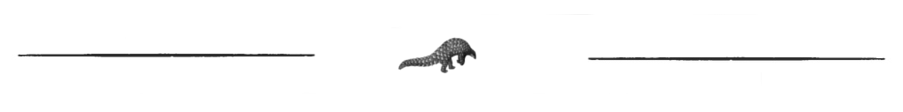

Thing
=========================================

The class ``Thing`` will only be used as a common parent for all other named entities classes.
As it is not safe to use, I describe it there just for fun.

Looking for *any*-Thing
^^^^^^^^^^^^^^^^^^^^^^^^^^^^^^^

Basic search
"""""""""""""

We want to find `አዲስ አበባ <https://en.wikipedia.org/wiki/Addis_Ababa>`_ (in Amharic) on DBPedia::

    from pyneql.ontology.thing import Thing
    from pyneql.utils.endpoints import Endpoint
    from pyneql.utils.enum import LanguagesIso6391 as Lang

    # Creating the Thing using its label, the language of the label
    # (If no language is specified, English is used)
    # and the endpoint on which the object should be queried.
    addis_abeba = Thing(
        label=u'አዲስ አበባ',
        query_language=Lang.Amharic
        endpoints=[Endpoint.dbpedia])

    # Sending the query
    addis_abeba.query()

Once the query is sent, the result information is stored in the object's
``attributes`` dictionary

Extended search
"""""""""""""""""

If the element we are looking for is ubiquitous in the Semantic Web, we may
want to search further. The function ``find_more_about()`` is doing that.
Before the exectution of the function ``find_more_about()``, we have 72 RDF predicates having values for Addis Abeba:

>>> addis_abeba = Thing(label=u'አዲስ አበባ', query_language=Lang.Amharic)
>>> addis_abeba.add_query_endpoints([Endpoint.dbpedia, Endpoint.wikidata])
>>> addis_abeba.query(strict_mode=True, check_type=True)
>>> len(addis_abeba.attributes)
72

Executing the function add some more

>>> addis_abeba.find_more_about()
>>> len(addis_abeba.attributes)
176

This feature just takes the URIs of the first result set which are the objects
of identity predicates (``skos:exactMatch``, ``owl:sameAs``) and retrieve the associated RDF triples.

Accessing information
^^^^^^^^^^^^^^^^^^^^^^^^^^^^^^^

Raw information
""""""""""""""""

It is possible to access raw information like that::

    addis_abeba.attributes

This dictionary contains all the information retrieved, so it is quite noisy.
For instance here for Addis Abeba, the content is::

    {
        skos:exactMatch: ([ "wd:Q3624" ]),
        wd:P131s: ([ "wd:Q3624S1D0A87FC-3366-4834-B6FE-7B477D146C64" ]),
        wd:P646s: ([ "wd:Q3624S5ADDAF15-6E16-4839-9BF6-344FEB79E162" ]),
        wd:P2044s: ([ "wd:Q3624S6DC89AB6-E1C0-4BAB-9427-5DE12A1B2F4C" ]),
        wd:P1296s: ([ "wd:Q3624S19F2DC2E-D87D-43F8-93F2-E14091B7227C" ]),
        wd:P18c: ([ "http://commons.wikimedia.org/wiki/File:Addis_Abeba_montage_1.jpg","http://commons.wikimedia.org/wiki/File:Addis_Abeba,_Ethiopia.jpg" ]),
        wd:P1566c: ([ "344979" ]),
        wd:P948s: ([ "wd:Q3624SD5575C92-2486-4985-9E74-223A3C53326D" ]),
        owl:sameAs: ([ "wd:Q3624" ]),
        wd:P2044c: ([ "2355" ]),
        wd:P131c: ([ "wd:Q115" ]),
        wd:P646c: ([ "/m/0dttf" ]),
        wd:P571c: ([ "1886" ]),
        skos:altLabel: ([ "Addis","Finifinee","Āddīs Ābebā" ]),
        validated: ([ "1" ]),
        wd:P18s: ([ "wd:Q3624SA63AC232-2D53-40BE-B863-29672C2A45C5","wd:Q3624S3A3DFD35-D0ED-4E62-9CE2-C507F32DF1CF" ]),
        wd:P1566s: ([ "wd:Q3624SE098E58A-752A-4781-A8C0-62D2D2819E81" ]),
        wd:P31c: ([ "wd:Q1637706","wd:Q5119" ]),
        wd:P948c: ([ "http://commons.wikimedia.org/wiki/File:Addis_Ababa_banner_Churchill_Avenue.jpg" ]),
        wd:P901s: ([ "wd:Q3624SCBDA79A9-1335-486A-8004-8FE076D39187" ]),
        wd:P1296c: ([ "0000693" ]),
        wd:P691s: ([ "wd:Q3624S5A0C7AB4-C305-4F0E-818C-15F45D796829" ]),
        rdf:type: ([ "wd:Q1637706","wd:Q5119","wdt_o:Item" ]),
        rdfs:label: ([ "أديس أبابا","അഡിസ് അബെബ","Adis Abeba","अदीस अबाबा","Neanthopolis","Аддис-Абеба","アディスアベバ","अदिस अबाबा","Адис Абеба","亚的斯亚贝巴","אדיס אבבה","Ադիս Աբեբա","Addis Abeba",,"ਆਦਿਸ ਆਬਬਾ","Addis-Abeb","Adis-Abeba","అద్దిస్ అబాబా","አዲስ አበባ","ადის-აბება","Adis-Abebo","Адыс-Абэба","ཨ་ཌི་སི་ཨ་བ་བ།","Addis Ababa","Addis-Abeba","Аддис-Абебæ","ئادیس ئابابا","แอดดิสอาบาบา","ಅಡಿಸ್ ಅಬಾಬ","Addisz-Abeba","آدیس آبابا","Adas Ababa","আদ্দিস আবাবা","Αντίς Αμπέμπα","Adis Ababa","اديس ابابا","Горад Адыс-Абеба","အာဒစ် အာဘာဘာမြို့","אדיס אבאבא","아디스아바바","Adís Abeba","阿,"Adisabeba","ادیس ابابا","அடிஸ் அபாபா" ]),
        wd:P227s: ([ "wd:Q3624S9F723A38-F075-4705-97A3-5D4CA21921D3" ]),
        wd:P214s: ([ "wd:Q3624SB25B5577-0C7A-4113-B996-0E55559BEB05" ]),
        wd:P901c: ([ "ET44" ]),
        wd:P691c: ([ "ge560694" ]),
        wd:P501s: ([ "wd:Q3624S59a9fa46-485a-1ff6-dae3-b1042742d09b" ]),
        wd:P227c: ([ "4000459-4" ]),
        wd:P1464c: ([ "wd:Q8042512" ]),
        wd:P214c: ([ "141880939" ]),
        wd:P17c: ([ "wd:Q115" ]),
        wd:P421s: ([ "wd:Q3624S0EA73678-4B48-45B2-9966-853C750786C5" ]),
        wd:P373c: ([ "Addis Ababa" ]),
        rdfs:seeAlso: ([ "http://d-nb.info/gnd/4000459-4/about/rdf","http://id.loc.gov/authorities/names/n79061184","http://data.bnf.fr/ark:/12148/cb119947834","http://viaf.org/viaf/141880939/rdf.xml","http://musicbrainz.org/8474f16d-03a0-4a09-adf3-df2d1e65ba2f/area","http://sws.geonames.org/344979/about.rdf" ]),
        wd:P402c: ([ "1707699" ]),
        wd:P1792s: ([ "wd:Q3624S69696269-BA7F-48C9-A456-9C0D3D587DB1" ]),
        wd:P910c: ([ "wd:Q6494411" ]),
        wd:P646-freebase: ([ "freebase:m.0dttf" ]),
        wd:P47c: ([ "wd:Q202107" ]),
        wd:P982s: ([ "wd:Q3624S0BFCAE75-E74B-4632-8083-E1880EA1B185" ]),
        wd:P1376s: ([ "wd:Q3624S7AF2107A-3FA4-44CC-BA4F-89B3D0C3BB76","wd:Q3624SFA52F9D2-E23F-455D-9DE4-D78254292864","wd:Q3624S7A150092-DB8B-4F13-B7B4-3EF71D20F483","wd:Q3624S620F4C91-0794-4862-8064-2397B8BC8152","wd:Q3624S0F815FBF-9880-4E4B-A896-34BA27FBAA25" ]),
        wd:P300s: ([ "wd:Q3624SBEEEB449-C42A-4B89-B0C9-75862406B0B7" ]),
        wd:P17s: ([ "wd:Q3624SA3142BF0-D61C-41DD-95AC-5CA90BB24B22" ]),
        wd:P1465s: ([ "wd:Q3624S6A273F76-363C-48AE-A1C5-8A89CEABB3FC" ]),
        wd:P501c: ([ "wd:Q202107" ]),
        wd:P402s: ([ "wd:Q3624S84ce2096-48c5-281a-b653-85adb42c8522" ]),
        wd:P421c: ([ "wd:Q6760" ]),
        wd:P373s: ([ "wd:Q3624S826F9B52-12B3-4247-B6D2-44A022F5F3A8" ]),
        wd:P1464s: ([ "wd:Q3624S34BB5F6F-9F47-4C0E-84E5-2635CB7E666B" ]),
        wd:P910s: ([ "wd:Q3624S70F309C9-D0DB-4C7C-9DAB-00F8646611BD" ]),
        wd:P47s: ([ "wd:Q3624S2B77959C-D191-4C7C-9EF5-37BB6137F53F" ]),
        wd:P982c: ([ "8474f16d-03a0-4a09-adf3-df2d1e65ba2f" ]),
        wd:P1376c: ([ "wd:Q940821","wd:Q207521","wd:Q2603305","wd:Q328478","wd:Q115" ]),
        wd:P1792c: ([ "wd:Q7905678" ]),
        wd:P244c: ([ "n79061184" ]),
        wd:P625s: ([ "wd:Q3624S7281893B-562E-4D07-B61A-87B6E7E4B5EE" ]),
        wd:P268c: ([ "119947834" ]),
        wd:P31s: ([ "wd:Q3624Sa67a20f3-4b64-86cc-2495-43342fff7e73","wd:Q3624S30e47a93-439e-4814-1cf6-b8905af9b684" ]),
        schemaorg:description: ([ "Hauptstadt von Äthiopien","capital y ciudad más poblada de Etiopía","πρωτεύουσα της Αιθιοπίας","capital city of Ethiopia","Etiopias hovedstad","capital e cidade máis poboada de Etiopía","capital e a maior cidade da Etiópia","città autonoma e capitale dell'Etiopia","הויפטשטאט פון עטיאפיע","Capitale de l'Éthiopie","इथियोपिया और अफ्रीकी संघ की राजधानी और सबसे बड़ा नगर","stad in Ethiopië","埃塞俄比亚首都","столица Эфиопии","בירת אתיופיה" ]),
        wd:P190s: ([ "wd:Q3624Saf2ff214-45e5-8ac1-6bf8-ed0e7d4a061e","wd:Q3624Se480f05f-42e2-261a-4c09-d98597a406c8","wd:Q3624S6242dfad-43d5-5d4e-2b32-cb23b31cac1b","wd:Q3624SF7121691-55FD-4674-85BE-DF3046BA5B65","wd:Q3624Saed04f83-4988-dd20-8049-1038299e8ddb","wd:Q3624S5c2c5b70-4ebb-89f2-4e62-a9dbac0ac94b","wd:Q3624S439D4620-D88D-4941-A44F-C392994892DA","wd:Q3624S0bb8fe71-4421-1134-c4e7-15cc9ed6e4e3","wd:Q3624SF25F050C-DDA2-49FB-903F-FDAD1D3B0EEE","wd:Q3624S58430ABE-3409-4CDC-B9E0-A7C9F187996C","wd:Q3624Sb9c07dda-4318-43ed-12b2-df6bb5d0af6e","wd:Q3624SF795AD2C-3AAF-4F1D-9D7F-F56265CE110B","wd:Q3624S03eb573f-4e91-72f2-715b-737fb5665d30" ]),
        wd:P625c: ([ "wd:VCdbe83a5eacb4564dfaa0b9eb374bd627" ]),
        http://purl.org/voc/vrank#hasRank: ([ "nodeID://b5794744" ]),
        wd:P244s: ([ "wd:Q3624S16E2B954-96FA-4920-9DFA-7449F2937EB0" ]),
        wd:P935s: ([ "wd:Q3624S8304D42A-447E-404E-997C-DCDE7223D681" ]),
        wd:P268s: ([ "wd:Q3624SFFC6BCE7-5C51-4D79-BC98-CEE22899B3D1" ]),
        wd:P935c: ([ "አዲስ አበባ" ]),
        wd:P300c: ([ "ET-AA" ]),
        wd:P190c: ([ "wd:Q2079","wd:Q956","wd:Q34647","wd:Q192225","wd:Q41843","wd:Q4115712","wd:Q11725","wd:Q42148","wd:Q1963","wd:Q33935","wd:Q62","wd:Q1754","wd:Q61" ]),
        wd:P571s: ([ "wd:Q3624S042796ae-4e14-35b8-8403-5746bfbbe5a7" ]),
        wd:P1465c: ([ "wd:Q9220488" ])
    }

Via keyword search
""""""""""""""""""""""

It is possible to search a keyword in the result set keys::

    addis_abeba.get_attributes_with_keyword('abel')

This gives us a subset of results whose keys match the substring ``abel``::

    {
        rdfs:label: ([ "أديس أبابا","അഡിസ് അബെബ","Adis Abeba","अदीस अबाबा","Neanthopolis","Аддис-Абеба","アディスアベバ","अदिस अबाबा","Адис Абеба","亚的斯亚贝巴","אדיס אבבה","Ադիս Աբեբա","Addis Abeba",,"ਆਦਿਸ ਆਬਬਾ","Addis-Abeb","Adis-Abeba","అద్దిస్ అబాబా","አዲስ አበባ","ადის-აბება","Adis-Abebo","Адыс-Абэба","ཨ་ཌི་སི་ཨ་བ་བ།","Addis Ababa","Addis-Abeba","Аддис-Абебæ","ئادیس ئابابا","แอดดิสอาบาบา","ಅಡಿಸ್ ಅಬಾಬ","Addisz-Abeba","آدیس آبابا","Adas Ababa","আদ্দিস আবাবা","Αντίς Αμπέμπα","Adis Ababa","اديس ابابا","Горад Адыс-Абеба","အာဒစ် အာဘာဘာမြို့","אדיס אבאבא","아디스아바바","Adís Abeba","阿","Adisabeba","ادیس ابابا","அடிஸ் அபாபா" ]),
        skos:altLabel: ([ "Addis","Finifinee","Āddīs Ābebā" ]),
    }

.. note::
    It is not yet possible to filter results by languages. It's on my todo list. Feel free to contribute to the project on `GitHub <https://github.com/Valerie-Hanoka/PyNeQL>`_ !

Code Documentation
^^^^^^^^^^^^^^^^^^

See :doc:`pyneql.ontology`.

